<p align="middle" >
  
</p>
<p align="middle">'개발자 과외는 천선'의 줄임말로 개발자와 학생을 매칭해주는 코딩 과외 플랫폼입니다.</p>

## 프로젝트 소개
- 개발 수업 진행을 원하는 선생님들은 과외 수업을 등록할 수 있습니다.
- 개발 수업 진행을 원하는 학생들은 과외 선생님에게 1:1 채팅을 통해 과외 문의를 진행하고 수업 신청을 할 수 있습니다.
- 온라인 공유 코드 에디터를 이용해 코딩 수업을 진행 할 수 있습니다.

## 화면

#### 메인
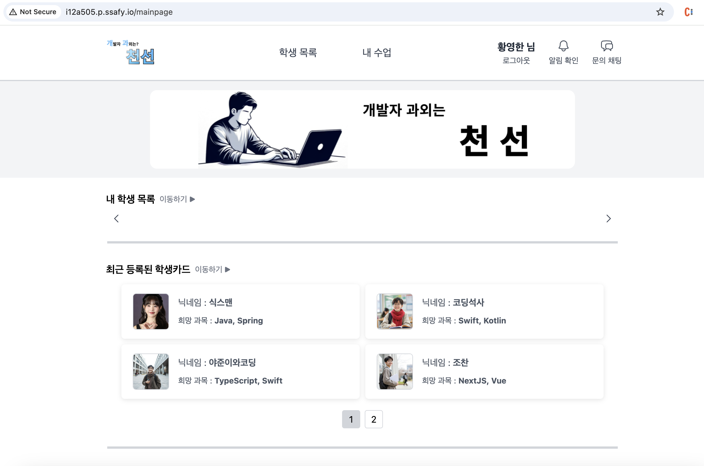

---

#### 로그인


---

#### 학생 소개글
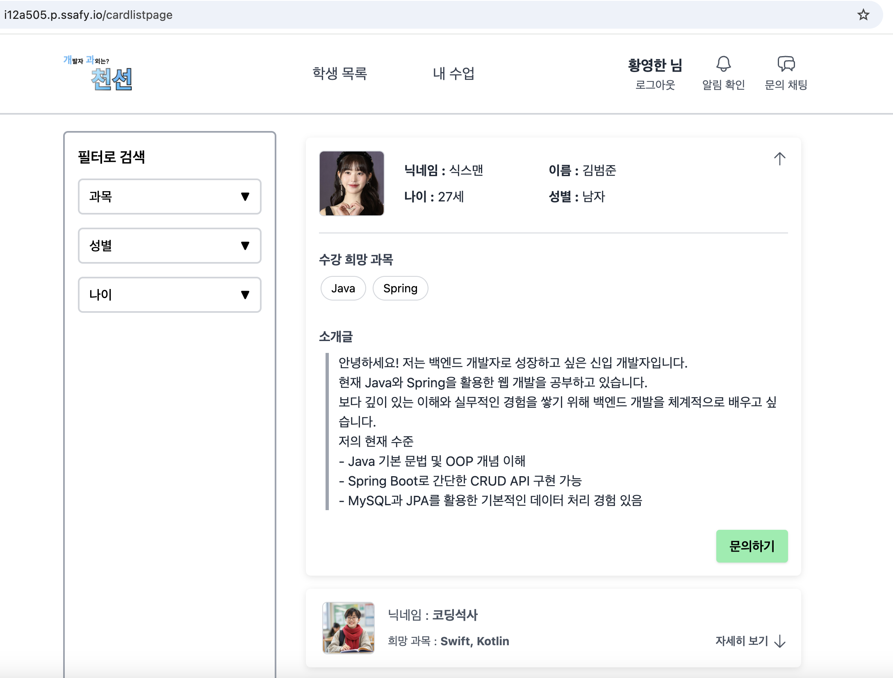

---

#### 선생 소개글
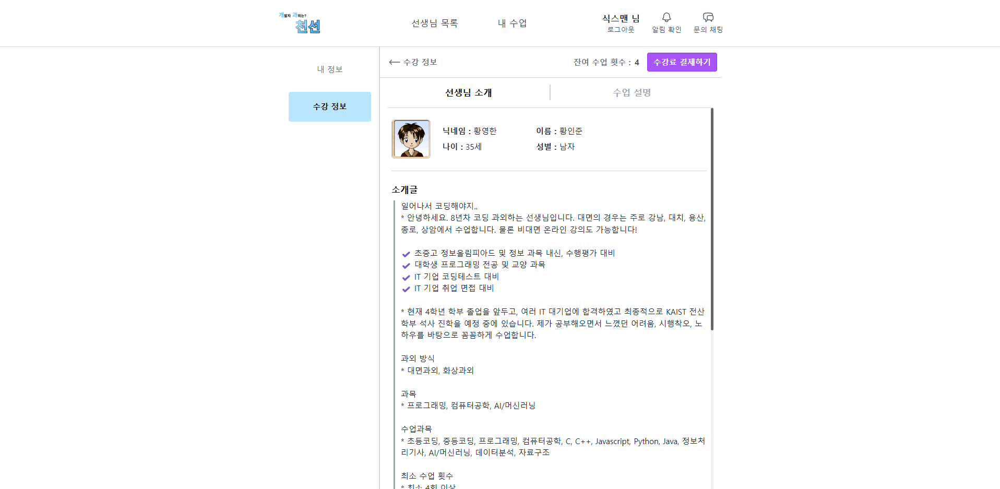

---

#### 강의 소개글
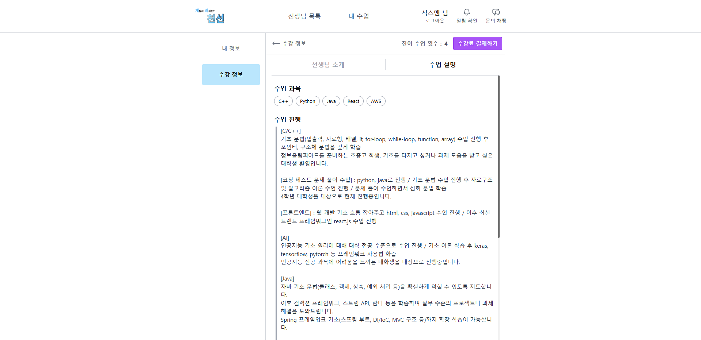

---

#### 채팅
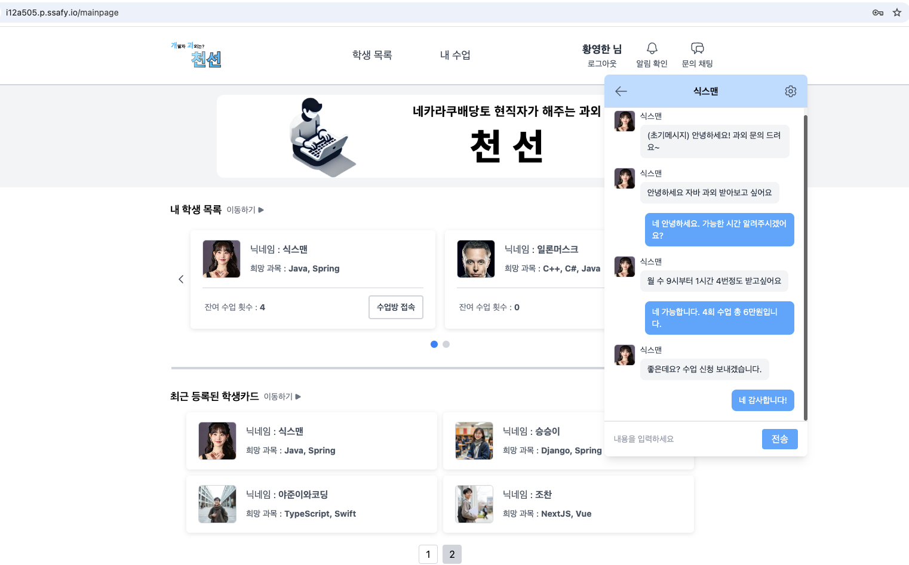

---

#### 수강 정보
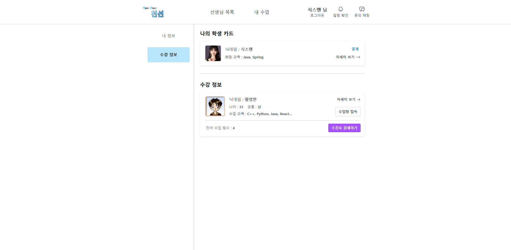

---

#### 알림
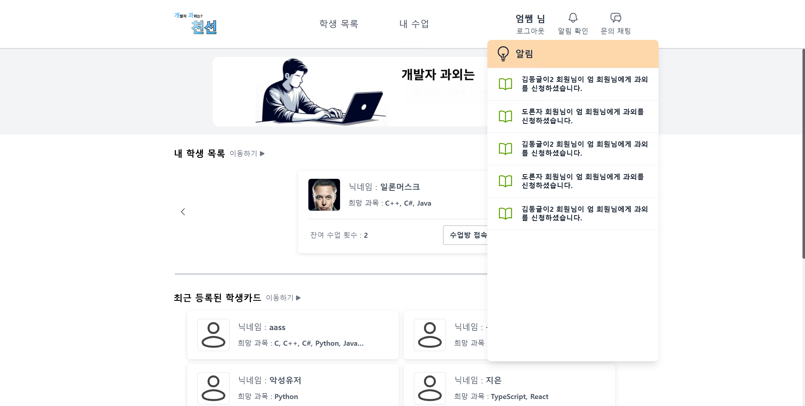

---

#### 쿠폰 알림
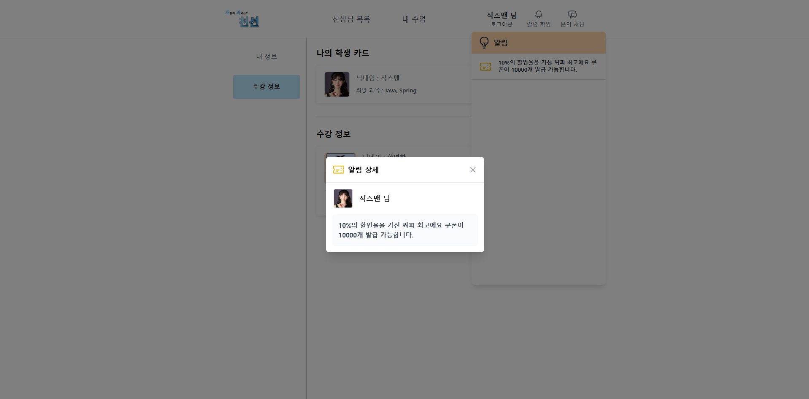

---

#### 결제
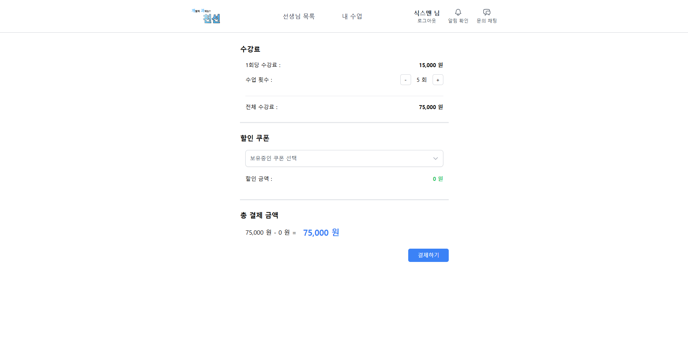

---

#### 랭킹
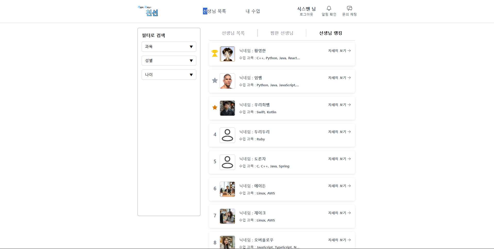

## 아키텍처
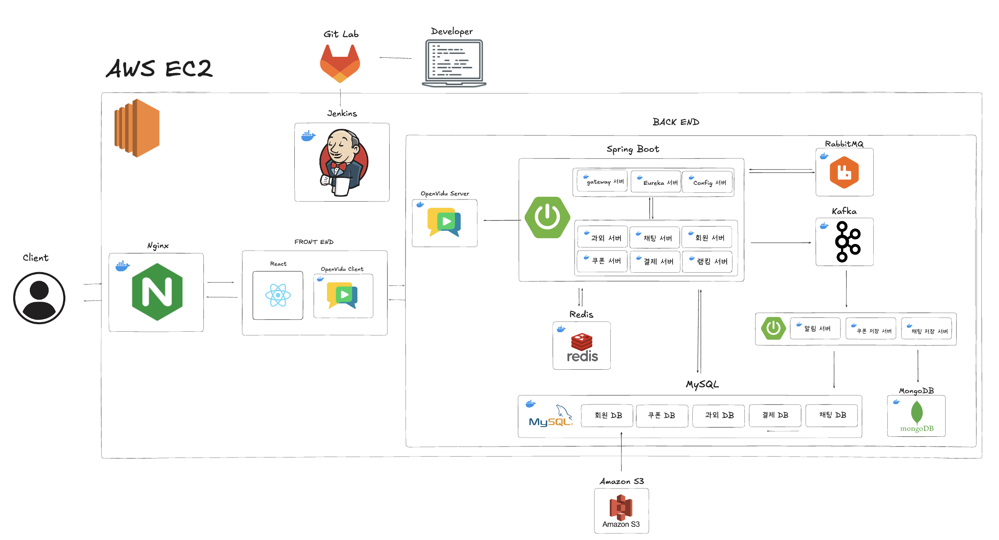

## ERD
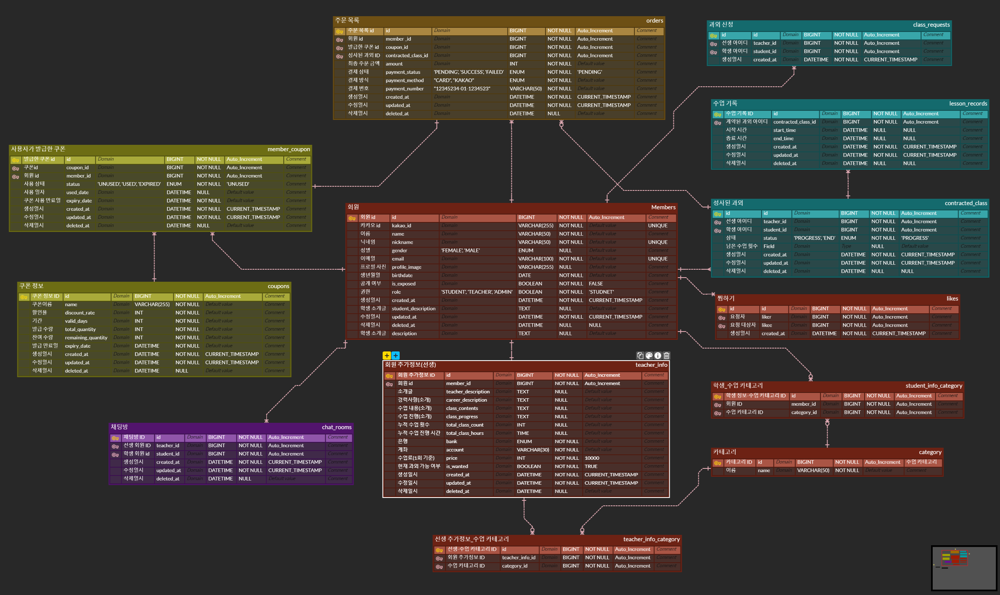

## 기술 스택

#### Back-End

<table border="0" style="border-collapse: collapse;">
  <tr>
    <td align="center" width="110" style="border: none;">
      <br/>
      <sub><b>Java 17</b></sub>
    </td>
    <td align="center" width="110" style="border: none;">
      <br/>
      <sub><b>Spring Boot 3.4.1</b></sub>
    </td>
    <td align="center" width="110" style="border: none;">
      <br/>
      <sub><b>Spring Data JPA</b></sub>
    </td>
    <td align="center" width="110" style="border: none;">
      <br/>
      <sub><b>Spring JDBC</b></sub>
    </td>
    <td align="center" width="110" style="border: none;">
      <br/>
      <sub><b>Spring Cloud</b></sub>
    </td>
    <td align="center" width="110" style="border: none;">
      <br/>
      <sub><b>Spring Security</b></sub>
    </td>
  </tr>
  <tr>
    <td align="center" width="110" style="border: none;">
      <br/>
      <sub><b>QueryDSL</b></sub></td>
    <td align="center" width="110" style="border: none;">
      <br>
      <sub><b>OAuth 2.0</b></sub></td>
    <td align="center" width="110" style="border: none;">
      <br>
      <sub><b>WebSocket</b></sub></td>
    <td align="center" width="110" style="border: none;">
      <br/>
      <sub><b>Kafka</b></sub>
    </td>
  </tr>
</table>

#### Front-End

<table border="0" style="border-collapse: collapse;">
  <tr>
    <td align="center" width="110" style="border: none;">
      <br/>
      <sub><b>React 19</b></sub>
    </td>
    <td align="center" width="110" style="border: none;">
      <br/>
      <sub><b>CSS</b></sub>
    </td>
    <td align="center" width="110" style="border: none;">
      <br/>
      <sub><b>HTML5</b></sub>
    </td>
    <td align="center" width="110" style="border: none;">
      <br/>
      <sub><b>JavaScript</b></sub>
    </td>
    <td align="center" width="110" style="border: none;"></td>
    <td align="center" width="110" style="border: none;"></td>
  </tr>
</table>

#### Database / Cache

<table border="0" style="border-collapse: collapse;">
  <tr>
    <td align="center" width="110" style="border: none;">
      <br/>
      <sub><b>Redis</b></sub>
    </td>
    <td align="center" width="110" style="border: none;">
      <br/>
      <sub><b>MongoDB</b></sub>
    </td>
    <td align="center" width="110" style="border: none;">
      <br/>
      <sub><b>MySQL</b></sub>
    </td>
    <td align="center" width="110" style="border: none;"></td>
    <td align="center" width="110" style="border: none;"></td>
    <td align="center" width="110" style="border: none;"></td>
  </tr>
</table>

#### Infra / DevOps

<table border="0" style="border-collapse: collapse;">
  <tr>
    <td align="center" width="110" style="border: none;">
      <br/>
      <sub><b>Docker</b></sub>
    </td>
    <td align="center" width="110" style="border: none;">
      <br/>
      <sub><b>AWS EC2</b></sub>
    </td>
    <td align="center" width="110" style="border: none;">
      <br/>
      <sub><b>AWS S3</b></sub>
    </td>
    <td align="center" width="110" style="border: none;">
      <br/>
      <sub><b>Jenkins</b></sub>
    </td>
    <td align="center" width="110" style="border: none;"></td>
  </tr>
</table>

## 주요 개발 기능 (담당)

### Spring Cloud 기반 MSA: 기술 스택 정리

아래는 마이크로서비스 아키텍처(MSA)를 도입하며 사용한 주요 **Spring Cloud** 관련 기술들에 대한 간단한 정리입니다. 실제 서비스에서 어떻게 적용했는지 기술별로 정리해두었습니다.

#### 1. Eureka
- **개념**: 마이크로서비스 간 **Service Discovery**를 제공하는 넷플릭스 OSS 컴포넌트
- **특징 및 적용 방식**  
  - **랜덤 포트 사용**: 서비스 기동 시 포트를 랜덤으로 할당해 **포트 충돌** 없이 **Scale-out** 가능  
  - **로드 밸런싱**: Eureka에 등록된 여러 인스턴스를 **라운드 로빈** 방식으로 균등 분배  
  - **Eureka Client**: 각 마이크로서비스는 **클라이언트**로 등록되며, Eureka Server에 자신의 호스트/포트 정보를 주기적으로 전달

---

#### 2. Spring Cloud Gateway
- **개념**: **API Gateway** 역할을 수행하여 클라이언트 요청을 내부 마이크로서비스로 라우팅
- **특징 및 적용 방식**  
  - **Spring Security 연동**: 게이트웨이에서 **인가(Authorization)** 로직 처리  
    - 예: 특정 요청에 대해 JWT 토큰 유효성 검사 후 라우팅  
  - **통합 진입점**: 클라이언트는 Gateway URL만 알면, 내부 마이크로서비스의 개별 주소를 몰라도 됨  
  - **통제 및 보안**: 공통 보안 정책을 게이트웨이 레벨에서 일괄 적용

---

#### 3. Spring Cloud Config
- **개념**: 마이크로서비스 환경에서 **환경 설정 파일**(application.yml 등)을 중앙 관리
- **특징 및 적용 방식**  
  1. **대칭키 암호화**  
     - **대칭키**를 이용해 **설정 파일 내용을 암호화**하고, Config Server에서 복호화 키를 소유  
     - 마이크로서비스는 Config Server로부터 **복호화된** 설정 값을 전달받아 민감 정보(예: DB 비밀번호, API 키 등)를 보호  
  2. **보안**  
     - Config Server를 **외부 포트**로 열어야 접근 가능하므로, Spring Security를 적용  
     - **admin 계정**만이 설정 관련 요청을 보낼 수 있도록 제한  
  3. **GitLab Repository**  
     - 실제 설정 파일들은 GitLab 저장소에서 버전 관리  
     - Config Server가 GitLab으로부터 설정 파일을 읽어옴  
  4. **무중단 갱신** (Bus AMQP 연계)  
     - **Spring Cloud Bus**를 통한 **실시간 설정 변경 반영**(아래 `Bus AMQP` 참조)

---

#### 4. Spring Cloud Bus (AMQP)
- **개념**: RabbitMQ 메시지 브로커를 이용해 **Config Server**와 마이크로서비스 간 **이벤트 브로드캐스팅**을 지원
- **특징 및 적용 방식**  
  - **AMQP 활용**: RabbitMQ 같은 AMQP 프로토콜 기반 메시지 브로커를 통해 **설정 변경**을 각 서비스에 전파  
  - **무중단 업데이트**: `bus-refresh` 이벤트로 yml 파일 변경을 **서버 재기동 없이** 적용  
  - 예) Config Server에서 설정 값이 변경되면, Bus 이벤트를 발행 → 각 마이크로서비스가 이벤트를 받아 **즉시 갱신**

---

#### 5. Actuator
- **개념**: Spring Boot 어플리케이션의 **진단, 모니터링, 측정**을 위한 라이브러리
- **특징 및 적용 방식**  
  - **Health Check**: `/actuator/health` 엔드포인트로 서비스 상태 확인  
  - **Bus-Refresh 연동**: `/actuator/bus-refresh` 엔드포인트 호출 시, Config Server에서 새로운 설정을 가져와 즉시 반영  

---

#### 6. OpenFeign
- **개념**: **서버 간 통신**(Microservice to Microservice) 시, **REST Client**를 손쉽게 생성할 수 있는 라이브러리
- **특징 및 적용 방식**  
  - **FeignClient**: 인터페이스 선언만으로, REST API 호출 로직을 구현 없이 사용 가능  
  - **Eureka 연계**: FeignClient가 `service-name`으로 호출 시, Eureka에서 해당 서비스 인스턴스를 조회하여 라우팅  
  - **편의성**: 요청 파라미터, 경로 매핑, 응답 형태 등을 **어노테이션**으로 간단하게 정의

---

#### 정리
1. **Eureka**를 통해 서비스 **Scale-out** 시 포트 충돌을 피하고 로드 밸런싱(라운드 로빈)을 제공  
2. **Gateway**가 요청을 받은 뒤, Spring Security로 **인가**를 처리한 후 각 마이크로서비스에 전달  
3. **Config Server**는 **대칭키**로 yml 설정 파일을 암호화/복호화 관리하며, Spring Security를 이용해 **admin** 계정만 접근 가능  
4. **GitLab** 저장소에서 설정 파일을 읽어오고, **Spring Cloud Bus(AMQP)**를 통해 무중단으로 설정 변경 사항을 **실시간 반영**  
5. **Actuator**로 **health check**와 **bus-refresh**를 관리, **OpenFeign**을 통해 **서버 간 통신** 로직을 간소화

---

### 쿠폰: Redis & Kafka를 활용한 선착순 쿠폰 이벤트

#### 요구사항
1. **대규모 트래픽** 상황(동시 접속)에 대비한 안정적인 쿠폰 발급 구조
2. **쿠폰 발급 수량 제한** 준수 (재고 수량 초과 불가)
3. **동일 쿠폰**에 대해 **1인당 1장**만 발급
---

#### 문제 해결 전략
- **쿠폰 발급 관리**와 **DB Write 작업**을 **분리**하여 **안정성과 성능**을 극대화  
- Redis로 **재고 및 발급 중복 관리**, Kafka를 통해 **비동기로 DB 저장** 처리
---

#### coupon-service
1. **Redis SET** 자료구조와 **트랜잭션(Transaction)** 활용
   - Redis의 **원자적** 연산을 통해 **쿠폰 재고**를 관리
   - `SET` 명령어를 이용해 이미 쿠폰을 발급받은 사용자(`memberId`)를 중복 체크
2. **Kafka Producer** 역할
   - 쿠폰 발급 성공 시, 발급 기록을 **Kafka**로 전송  
   - DB 저장은 별도의 서비스에서 처리하므로, 메인 로직의 부담을 줄임

#### coupon-kafka-service
1. **Kafka Consumer** 역할
   - `coupon-service`에서 전달받은 쿠폰 발급 내역을 **소비(Consume)**  
   - **배치 처리** 방식으로 DB에 저장
2. **JDBC Bulk Insert** 활용
   - 일정 건수(최대 1000건)까지 쌓은 뒤 **일괄 Insert**  
   - **DB Connection 횟수**를 줄여 Write 부하 최소화
---

#### K6 부하 테스트 시나리오
- **테스트 환경**: EC2 리소스(10 core CPU, 16GB RAM) + Docker Container  
- **가상 사용자(VU) 100명**이 각각 200번씩 요청 → 총 **20,000건** 쿠폰 발급 요청  
- **memberId**: 1 ~ 20,000까지 고유 아이디로 중복 발급 검증
``` javascript
import http from 'k6/http';
import { check, sleep } from 'k6';

export let options = {
  scenarios: {
    coupon_issue: {
      executor: 'per-vu-iterations',
      vus: 100,         // 100명의 VU
      iterations: 200,  // 각 VU가 200번씩 요청 → 총 100 * 200 = 20,000건
      maxDuration: '1h', // 최대 실행 시간: 1시간 (모든 요청 완료 시 테스트 종료)
    },
  },
  thresholds: {
    http_req_failed: ['rate < 0.01'],   // 실패율 1% 미만
    http_req_duration: ['p(95) < 500'],  // 95% 요청 응답시간 500ms 미만
  },
};

export default function () {
  // 실제 VU 수는 100이므로, 전역 고유 인덱스 계산에 사용할 totalVUs도 100입니다.
  const totalVUs = 100;
  // 총 요청 수는 100 * 200 = 20,000건입니다.
  const totalRequests = 200 * totalVUs;
  // 각 VU의 로컬 반복 번호(__ITER)는 0부터 시작하고, __VU는 1부터 시작합니다.
  // 전역 고유 인덱스 = (__ITER * totalVUs) + (__VU - 1)
  const globalIndex = (__ITER * totalVUs) + (__VU - 1);
  
  // memberId는 globalIndex + 1로 1부터 20,000까지 할당됩니다.
  const memberId = globalIndex + 1;
  
  const url = `http://localhost:8080/coupon-kafka-service/coupons/test/${memberId}`;
  const payload = JSON.stringify({
    couponId: 1,   // couponId는 항상 1
    validDays: 10, // 예: 쿠폰 유효기간 10일
  });
  
  const res = http.post(url, payload, {
    headers: { 'Content-Type': 'application/json' },
    tags: { name: 'coupon_issue' },
  });
  
  check(res, {
    'coupon issued successfully': (r) => r.status === 201,
  });
}
```
---
##### Redis & Kafka 도입 전 (단순 Write/Update, DB Pessimistic Lock)
- **성공률**: 100% (20,000건 성공, `http_req_failed` = 0%)
- **응답 시간**: 평균 348.62ms, 90% 구간 441.54ms, 95% 구간 460.66ms
- **처리량**: 약 285 TPS (초당 285건 처리)
- **총 소요 시간**: 약 1분 10초


##### Redis & Kafka 도입 후
- **성공률**: 100% (20,000건 성공, `http_req_failed` = 0%)
- **응답 시간**: 평균 101.36ms, 90% 구간 146.62ms, 95% 구간 184.02ms
- **처리량**: 약 966 TPS (초당 966건 처리)
- **총 소요 시간**: 약 20.7초
- **약 3.4배의 성능 향상** 확인


---

#### 결론
- **Redis**와 **Kafka**를 도입해 **선착순 쿠폰** 이벤트 발급 시 발생하는 동시 요청을 **안정적으로 처리**할 수 있었음
- **Batch** 방식과 **Bulk Insert, Bulk Update**를 통해 DB 트래픽을 획기적으로 줄여 **성능** 향상  
- **중복 발급 방지**와 **재고 수량 관리**를 Redis에서 책임지면서, **데이터 무결성**을 실시간 보장

## 팀원

|                                         Backend                                          |                                         Backend                                          |                                         Backend                                          |                                         Backend                                         |                                       Frontend                                        |
| :--------------------------------------------------------------------------------------: | :--------------------------------------------------------------------------------------: | :--------------------------------------------------------------------------------------: | :-------------------------------------------------------------------------------------: | :-----------------------------------------------------------------------------------: |
|  |  |  |  |  |
|                       [문인규](https://github.com/InGyu-Moon)                        |                            [유선우](https://github.com/BrokenFinger98)                            |                            [황인준](https://github.com/InJun2)                            |                          [김범준](https://github.com/Junnn4?tab=repositories)                           |                         [엄윤준](https://github.com/june2301)                         |
